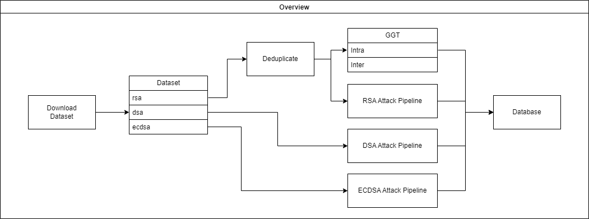
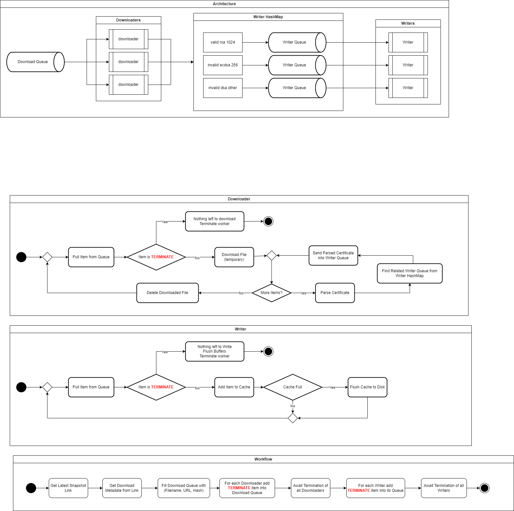
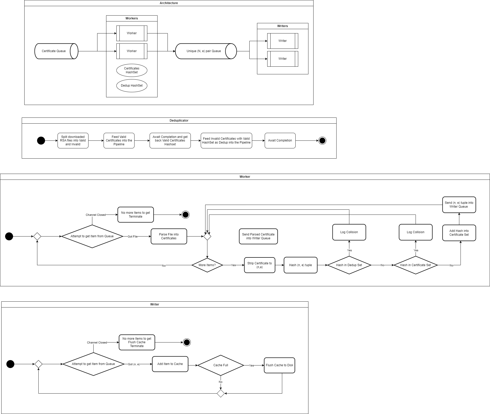
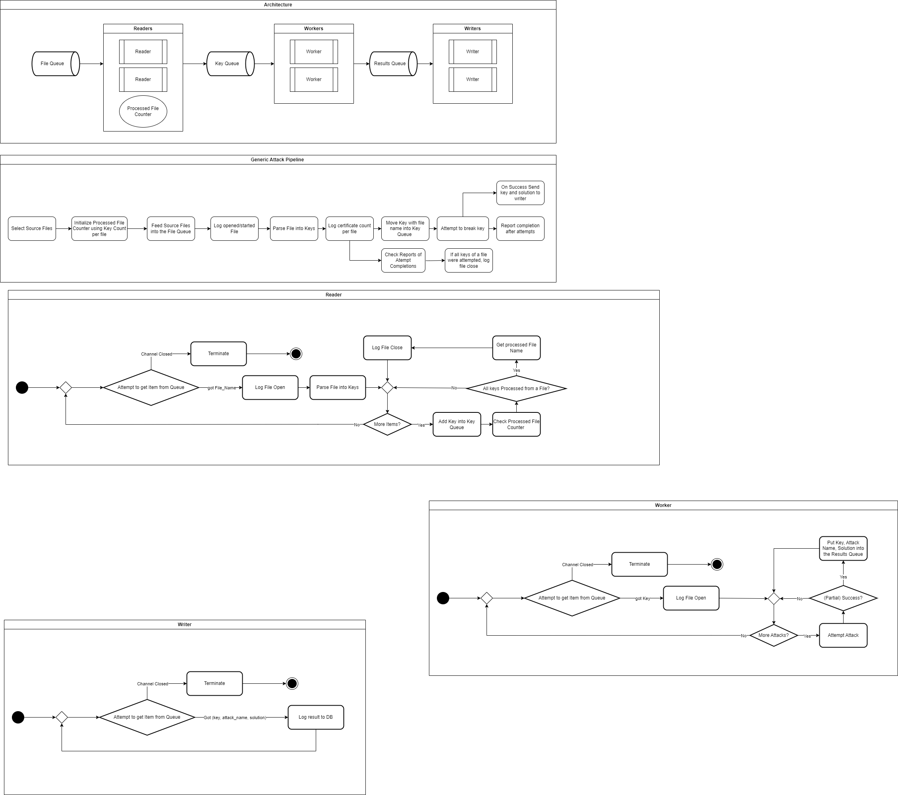
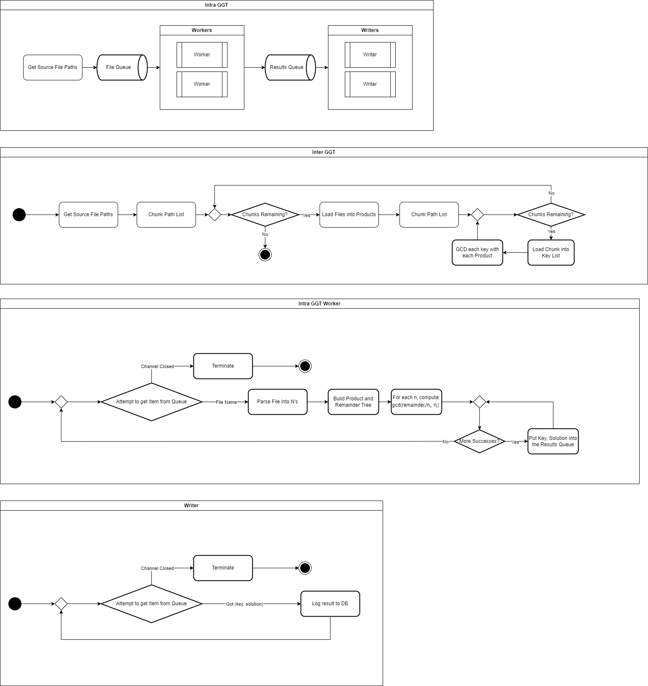

# Documentation

This repository is a generic overwiew of the entire project.

## Overview

This project is intended to analyze large datasets of cryptographic keys (currently RSA) for vulnerabilities using a modular and extensible pipeline architecture.

## 1. Download

Download the dataset using `certificate_downloader`

## 2. Deduplicate

Deduplicate the dataset using `deduplicator-mem`

## 3. Analyze

### 3.1 Analyze using singular attacks

### 3.2 Analyze using GGT

